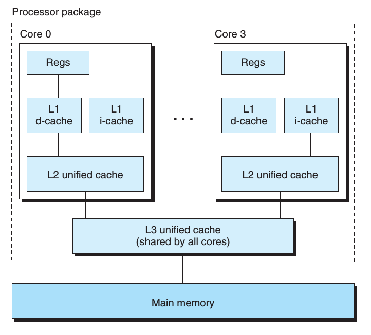

# 中央处理器（Central processing unit）

## 概念

CPU其实就是计算机内部的一个电子电路。根据一些具体的指令它可以执行基本的运算，逻辑，控制和IO操作等。CPU的主要组件包括：

 * 算术逻辑单元（ALU is short for ‘arithmetic logic unit’），它主要执行一些算术和逻辑操作
 * 处理器寄存器（processor registers），它主要的作用是给ALU提供操作数并存储ALU操作的结果
 * 控制器（control unit），通过协调ALU，寄存器和其它组件之间的操作，从主存中取得并执行相应的指令。

当今大多数地CPU都是微处理器，即它们被包含在单个集成电路芯片（integrated circuit chip）中。一个包含CPU的集成电路可能也包含内存，外围接口和其它的一些计算机组件。这样的集成设备叫做微控制器（microcontrollers）或者芯片上的系统（SoC）。一些计算机采用多核处理器，即单个芯片中包含2个或更多的CPU（也被叫做“cores”）; 在这种情况下，单个芯片有时也被称作”sockets”.


## 架构

目前市面上的CPU分类主要分有两大阵营，一个是intel、AMD为首的复杂指令集CPU，另一个是以IBM、ARM为首的精简指令集CPU。两个不同品牌的CPU，其产品的架构也不相同，例如，Intel、AMD的CPU是X86架构的，而IBM公司的CPU是PowerPC架构，ARM公司是ARM架构。

## CPU中的一些技术

### 术语

* socket: 主板上的CPU插槽; 
* Core:   socket里独立的一组程序执行的硬件单元，比如寄存器，计算单元等; 
* Thread: 超线程hyper-thread的概念，逻辑的执行单元，独立的执行上下文，但是共享core内的寄存器和计算单元。

### Hyper-Threading

Hyper-threading这个概念是Intel提出的，通常个人处理器仅有单个CPU核心，因此它一次只能做一件事情。但是Hyper-threading技术的出现弥补了这个不足。

Hyperthreading 有时叫做 simultaneous multi-threading，它可以使我们的单核CPU执行多个控制流程。这个技术会涉及到备份一些CPU硬件的一些信息，比如程序计数器和寄存器文件等，而对于比如执行浮点运算的单元它只有一个备份，可以被共享。一个传统的处理器在线程之间切换大约需要20000时钟周期，而一个具有Hyperthreading技术的处理器只需要1个时钟周期，因此这大大减小了线程之间切换的成本。hyperthreading技术的关键点就是：当我们在处理器中执行代码时，很多时候处理器并不会使用到全部的计算能力，部分计算能力会处于空闲状态，而hyperthreading技术会更大程度地“压榨”处理器。举个例子，如果一个线程必须要等到一些数据加载到缓存中以后才能继续执行，此时CPU可以切换到另一个线程去执行，而不用去处于空闲状态，等待当前线程的IO执行完毕。

Hyper-threading 使操作系统认为处理器(processor)的数目是实际核心数(cores)的2倍，因此如果有4个核心的处理器，操作系统会认为处理器有8个processors。这项技术通常会对程序有一个性能的提升，通常提升的范围大约在15%-30%之间，对于一些程序来说它的性能甚至会小于20%, 其实性能是否提升这完全取决于具体的程序。比如，这2个逻辑核心都需要用到处理器的同一个组件，那么一个线程必须要等待。因此，Hyper-threading只是一种“欺骗”手段，对于一些程序来说，它可以更有效地利用CPU的计算能力，但是它的性能远没有真正有2个核心的处理器性能好，因此它不能替代真正有2个核心的处理器。但是同样都是2核的处理器，一个有hyper-threading技术而另一个没有，那么有这项技术的处理器在大部分情况下都要比没有的好。

### 多核

相比于多个处理器而言，多核处理器把多个CPU（核心）集成到单个集成电路芯片（integrated circuit chip）中，因此主板的单个socket也可以适应这样的CPU，不需要去更更改一些硬件结构。一个双核的CPU有2个中央处理单元，因此不像上面我介绍的hyper-threading技术那样，操作系统看到的只是一种假象，这回操作系统看到的是真正的2个核心，所以2个不同的进程可以分别在不同的核心中同时执行，这大大加快了系统的速度。由于2个核心都在一个芯片上，因此它们之间的通信也要更快，系统也会有更小地延迟。

下图展示了一个Intel Core i7处理器的一个组织结构，这个微处理器芯片中有4个CPU核，每个核中都有它自己的L1和L2缓存。



### 多处理器

我们一直以来的目标就是想要计算机可以做更多的事情，并且做的更快。因此人们想到通过增加CPU的数量来增加计算机的计算机能力和速度，但是这样的方法并没有在个人PC中得到普及，我们只会在一些超级计算机或者一些服务器上会看到这个多个CPU的计算机。因为多个CPU会需要主板有多个CPU socket - 多个CPU被插入到不同的socket中。同时主板也需要额外的硬件去连接这些CPU socket到RAM和一些其它的资源。如果CPU之间需要彼此通信，多个CPU的系统会有很大地开销。

* SMP(Symmetric Multi-Processor)

所谓对称多处理器结构，是指服务器中多个CPU对称工作，无主次或从属关系。各CPU共享相同的物理内存，每个 CPU访问内存中的任何地址所需时间是相同的，因此SMP也被称为一致存储器访问结构(UMA：Uniform Memory Access)。对SMP服务器进行扩展的方式包括增加内存、使用更快的CPU、增加CPU、扩充I/O(槽口数与总线数)以及添加更多的外部设备(通常是磁盘存储)。

SMP服务器的主要特征是共享，系统中所有资源(CPU、内存、I/O等)都是共享的。也正是由于这种特征，导致了SMP服务器的主要问题，那就是它的扩展能力非常有限。对于SMP服务器而言，每一个共享的环节都可能造成SMP服务器扩展时的瓶颈，而最受限制的则是内存。由于每个CPU必须通过相同的内存总线访问相同的内存资源，因此随着CPU数量的增加，内存访问冲突将迅速增加，最终会造成CPU资源的浪费，使 CPU性能的有效性大大降低。实验证明，SMP服务器CPU利用率最好的情况是2至4个CPU。

* NUMA(Non-Uniform Memory Access)

由于SMP在扩展能力上的限制，人们开始探究如何进行有效地扩展从而构建大型系统的技术，NUMA就是这种努力下的结果之一。利用NUMA技术，可以把几十个CPU(甚至上百个CPU)组合在一个服务器内。其CPU模块结构如图2所示： 


NUMA服务器的基本特征是具有多个CPU模块，每个CPU模块由多个CPU(如4个)组成，并且具有独立的本地内存、I/O槽口等。由于其节点之间可以通过互联模块(如称为Crossbar Switch)进行连接和信息交互，因此每个CPU可以访问整个系统的内存。显然，访问本地内存的速度将远远高于访问远地内存(系统内其它节点的内存)的速度，这也是非一致存储访问NUMA的由来。由于这个特点，为了更好地发挥系统性能，开发应用程序时需要尽量减少不同CPU模块之间的信息交互。

NUMA体系结构中多了Node的概念，这个概念其实是用来解决core的分组的问题，具体参见下图来理解，从图中可以看出每个Socket里有两个node，共有4个socket，每个socket 2个node，每个node中有8个thread，总共4（Socket）× 2（Node）× 8 （4core × 2 Thread） = 64个thread。

另外每个node有自己的内部CPU，总线和内存，同时还可以访问其他node内的内存，NUMA的最大的优势就是可以方便的增加CPU的数量，因为Node内有自己内部总线，所以增加CPU数量可以通过增加Node的数目来实现，如果单纯的增加CPU的数量，会对总线造成很大的压力。


根据上面提到的，由于每个node内部有自己的CPU总线和内存，所以如果一个虚拟机的vCPU跨不同的Node的话，就会导致一个node中的CPU去访问另外一个node中的内存的情况，这就导致内存访问延迟的增加。在有些特殊场景下，比如NFV环境中，对性能有比较高的要求，就非常需要同一个虚拟机的vCPU尽量被分配到同一个Node中的CPU上

比较常用的命令就是lscpu，具体输出如下：
```
Architecture:          x86_64  
CPU op-mode(s):        32-bit, 64-bit  
Byte Order:            Little Endian  
CPU(s):                48                                       //共有48个逻辑CPU（threads）  
On-line CPU(s) list:   0-47  
Thread(s) per core:    2                               //每个core有2个threads  
Core(s) per socket:    6                                //每个socket有6个cores  
Socket(s):             4                                      //共有4个sockets  
NUMA node(s):          4                               //共有4个NUMA nodes  
Vendor ID:             GenuineIntel  
CPU family:            6  
Model:                 45  
Stepping:              7  
CPU MHz:               1200.000  
BogoMIPS:              4790.83  
Virtualization:        VT-x  
L1d cache:             32K                           //L1 data cache 32k  
L1i cache:             32K                            //L1 instruction cache 32k  （牛x机器表现，冯诺依曼+哈弗体系结构）  
L2 cache:              256K  
L3 cache:              15360K  
NUMA node0 CPU(s):     0-5,24-29        
NUMA node1 CPU(s):     6-11,30-35  
NUMA node2 CPU(s):     12-17,36-41  
NUMA node3 CPU(s):     18-23,42-47  
```

# /proc/cpuinfo文件分析

　　在Linux系统中，提供了proc文件系统显示系统的软硬件信息。如果想了解系统中CPU的提供商和相关配置信息，则可以通过/proc/cpuinfo文件得到。

　　基于不同指令集（ISA）的CPU产生的/proc/cpuinfo文件不一样，基于X86指令集CPU的/proc/cpuinfo文件包含如下内容：
```
processor　　： 0
vendor_id　　：GenuineIntel
cpu family　　：6
model　　　　：26
model name　：Intel(R) Xeon(R) CPU           E5520  @ 2.27GHz
stepping　　  ：5
cpu MHz　　  ：1600.000
cache size　　： 8192 KB
physical id　　：0
siblings　　　 ：8
core id　　　  ： 0
cpu cores　　 ：4
apicid　　       ：0
fpu　　　　　  ：yes
fpu_exception ：yes
cpuid level　　 ： 11
wp　　　　　　：yes
flags 　　　　　： fpu vme de pse tsc msr pae mce cx8 apic sep mtrr pge mca cmov pat pse36 clflush dts acpi mmx fxsr sse sse2 ss ht tm syscall nx rdtscp lm constant_tsc ida nonstop_tsc pni monitor ds_cpl vmx est tm2 cx16 xtpr popcnt lahf_lm
bogomips　　 ：4522.12
clflush size　　：64
cache_alignment　　： 64
address sizes　　　 ： 40 bits physical, 48 bits virtual
power management ：
```
以上输出项的含义如下：
```
processor　：系统中逻辑处理核的编号。对于单核处理器，则课认为是其CPU编号，对于多核处理器则可以是物理核、或者使用超线程技术虚拟的逻辑核
vendor_id　：CPU制造商     
cpu family　：CPU产品系列代号
model　　　：CPU属于其系列中的哪一代的代号
model name：CPU属于的名字及其编号、标称主频
stepping　  ：CPU属于制作更新版本
cpu MHz　  ：CPU的实际使用主频
cache size   ：CPU二级缓存大小
physical id   ：单个CPU的标号
siblings       ：单个CPU逻辑物理核数
core id        ：当前物理核在其所处CPU中的编号，这个编号不一定连续
cpu cores    ：该逻辑核所处CPU的物理核数
apicid          ：用来区分不同逻辑核的编号，系统中每个逻辑核的此编号必然不同，此编号不一定连续
fpu             ：是否具有浮点运算单元（Floating Point Unit）
fpu_exception  ：是否支持浮点计算异常
cpuid level   ：执行cpuid指令前，eax寄存器中的值，根据不同的值cpuid指令会返回不同的内容
wp             ：表明当前CPU是否在内核态支持对用户空间的写保护（Write Protection）
flags          ：当前CPU支持的功能
bogomips   ：在系统内核启动时粗略测算的CPU速度（Million Instructions Per Second）
clflush size  ：每次刷新缓存的大小单位
cache_alignment ：缓存地址对齐单位
address sizes     ：可访问地址空间位数
power management ：对能源管理的支持，有以下几个可选支持功能：

　　ts：　　temperature sensor

　　fid：　  frequency id control

　　vid：　 voltage id control

　　ttp：　 thermal trip

　　tm：

　　stc：

　　100mhzsteps：

　　hwpstate：
```
　　

CPU信息中flags各项含义：
```
fpu： Onboard (x87) Floating Point Unit
vme： Virtual Mode Extension
de： Debugging Extensions
pse： Page Size Extensions
tsc： Time Stamp Counter: support for RDTSC and WRTSC instructions
msr： Model-Specific Registers
pae： Physical Address Extensions: ability to access 64GB of memory; only 4GB can be accessed at a time though
mce： Machine Check Architecture
cx8： CMPXCHG8 instruction
apic： Onboard Advanced Programmable Interrupt Controller
sep： Sysenter/Sysexit Instructions; SYSENTER is used for jumps to kernel memory during system calls, and SYSEXIT is used for jumps： back to the user code
mtrr： Memory Type Range Registers
pge： Page Global Enable
mca： Machine Check Architecture
cmov： CMOV instruction
pat： Page Attribute Table
pse36： 36-bit Page Size Extensions: allows to map 4 MB pages into the first 64GB RAM, used with PSE.
pn： Processor Serial-Number; only available on Pentium 3
clflush： CLFLUSH instruction
dtes： Debug Trace Store
acpi： ACPI via MSR
mmx： MultiMedia Extension
fxsr： FXSAVE and FXSTOR instructions
sse： Streaming SIMD Extensions. Single instruction multiple data. Lets you do a bunch of the same operation on different pieces of input： in a single clock tick.
sse2： Streaming SIMD Extensions-2. More of the same.
selfsnoop： CPU self snoop
acc： Automatic Clock Control
IA64： IA-64 processor Itanium.
ht： HyperThreading. Introduces an imaginary second processor that doesn’t do much but lets you run threads in the same process a  bit quicker.
nx： No Execute bit. Prevents arbitrary code running via buffer overflows.
pni： Prescott New Instructions aka. SSE3
vmx： Intel Vanderpool hardware virtualization technology
svm： AMD “Pacifica” hardware virtualization technology
lm： “Long Mode,” which means the chip supports the AMD64 instruction set
tm： “Thermal Monitor” Thermal throttling with IDLE instructions. Usually hardware controlled in response to CPU temperature.
tm2： “Thermal Monitor 2″ Decrease speed by reducing multipler and vcore.
est： “Enhanced SpeedStep”
```
根据以上内容，我们则可以很方便的知道当前系统关于CPU、CPU的核数、CPU是否启用超线程等信息。

* 查询系统具有多少个逻辑核：`cat /proc/cpuinfo | grep "processor" | wc -l`

* 查询系统CPU的物理核数：`cat /proc/cpuinfo | grep "cpu cores" | uniq`

* 查询系统CPU是否启用超线程：`cat /proc/cpuinfo | grep -e "cpu cores"  -e "siblings" | sort | uniq`

　　输出举例：
```
　　　　cpu cores    : 6
　　　　siblings    　: 6
```
　　如果cpu cores数量和siblings数量一致，则没有启用超线程，否则超线程被启用。

* 查询系统CPU的个数：`cat /proc/cpuinfo | grep "physical id" | sort | uniq | wc -l`

* 查询系统CPU是否支持某项功能，则根以上类似，输出结果进行sort， uniq和grep就可以得到结果。

【/proc/cpuinfo内容举例】
```
1，Intel(R) Xeon(R) X5355

processor　　: 0
vendor_id　　: GenuineIntel
cpu famil　　: 6
model　　　　 : 15
model name　 : Intel(R) Xeon(R) CPU           X5355  @ 2.66GHz
stepping　　 : 7
cpu MHz　　　: 2666.766
cache size　: 4096 KB
physical id　: 0
siblings　　 : 4
core id　　  : 0
cpu cores　　: 4
fpu　　　　　 : yes
fpu_exception　　: yes
cpuid level　　　: 10
wp　　　　　　: yes
flags　　　　: fpu vme de pse tsc msr pae mce cx8 apic sep mtrr pge mca cmov pat pse36 clflush dts acpi mmx fxsr sse sse2 ss ht tm syscall lm constant_tsc pni monitor ds_cpl vmx est tm2 cx16 xtpr dca lahf_lm
bogomips    : 5338.26
clflush size    : 64
cache_alignment : 64
address sizes   : 36 bits physical, 48 bits virtual
power management:

processor    : 1
vendor_id    : GenuineIntel
cpu family    : 6
model        : 15
model name    : Intel(R) Xeon(R) CPU           X5355  @ 2.66GHz
stepping    : 7
cpu MHz        : 2666.766
cache size    : 4096 KB
physical id    : 1
siblings    : 4
core id        : 0
cpu cores    : 4
fpu        : yes
fpu_exception    : yes
cpuid level    : 10
wp        : yes
flags        : fpu vme de pse tsc msr pae mce cx8 apic sep mtrr pge mca cmov pat pse36 clflush dts acpi mmx fxsr sse sse2 ss ht tm syscall lm constant_tsc pni monitor ds_cpl vmx est tm2 cx16 xtpr dca lahf_lm
bogomips    : 5333.75
clflush size    : 64
cache_alignment    : 64
address sizes    : 36 bits physical, 48 bits virtual
power management:

processor    : 2
vendor_id    : GenuineIntel
cpu family    : 6
model        : 15
model name    : Intel(R) Xeon(R) CPU           X5355  @ 2.66GHz
stepping    : 7
cpu MHz        : 2666.766
cache size    : 4096 KB
physical id    : 0
siblings    : 4
core id        : 2
cpu cores    : 4
fpu        : yes
fpu_exception    : yes
cpuid level    : 10
wp        : yes
flags        : fpu vme de pse tsc msr pae mce cx8 apic sep mtrr pge mca cmov pat pse36 clflush dts acpi mmx fxsr sse sse2 ss ht tm syscall lm constant_tsc pni monitor ds_cpl vmx est tm2 cx16 xtpr dca lahf_lm
bogomips    : 5333.67
clflush size    : 64
cache_alignment    : 64
address sizes    : 36 bits physical, 48 bits virtual
power management:

processor    : 3
vendor_id    : GenuineIntel
cpu family    : 6
model        : 15
model name    : Intel(R) Xeon(R) CPU           X5355  @ 2.66GHz
stepping    : 7
cpu MHz        : 2666.766
cache size    : 4096 KB
physical id    : 1
siblings    : 4
core id        : 2
cpu cores    : 4
fpu        : yes
fpu_exception    : yes
cpuid level    : 10
wp        : yes
flags        : fpu vme de pse tsc msr pae mce cx8 apic sep mtrr pge mca cmov pat pse36 clflush dts acpi mmx fxsr sse sse2 ss ht tm syscall lm constant_tsc pni monitor ds_cpl vmx est tm2 cx16 xtpr dca lahf_lm
bogomips    : 5333.68
clflush size    : 64
cache_alignment    : 64
address sizes    : 36 bits physical, 48 bits virtual
power management:

processor    : 4
vendor_id    : GenuineIntel
cpu family    : 6
model        : 15
model name    : Intel(R) Xeon(R) CPU           X5355  @ 2.66GHz
stepping    : 7
cpu MHz        : 2666.766
cache size    : 4096 KB
physical id    : 0
siblings    : 4
core id        : 1
cpu cores    : 4
fpu        : yes
fpu_exception    : yes
cpuid level    : 10
wp        : yes
flags        : fpu vme de pse tsc msr pae mce cx8 apic sep mtrr pge mca cmov pat pse36 clflush dts acpi mmx fxsr sse sse2 ss ht tm syscall lm constant_tsc pni monitor ds_cpl vmx est tm2 cx16 xtpr dca lahf_lm
bogomips    : 5333.67
clflush size    : 64
cache_alignment    : 64
address sizes    : 36 bits physical, 48 bits virtual
power management:

processor    : 5
vendor_id    : GenuineIntel
cpu family    : 6
model        : 15
model name    : Intel(R) Xeon(R) CPU           X5355  @ 2.66GHz
stepping    : 7
cpu MHz        : 2666.766
cache size    : 4096 KB
physical id    : 1
siblings    : 4
core id        : 1
cpu cores    : 4
fpu        : yes
fpu_exception    : yes
cpuid level    : 10
wp        : yes
flags        : fpu vme de pse tsc msr pae mce cx8 apic sep mtrr pge mca cmov pat pse36 clflush dts acpi mmx fxsr sse sse2 ss ht tm syscall lm constant_tsc pni monitor ds_cpl vmx est tm2 cx16 xtpr dca lahf_lm
bogomips    : 5333.68
clflush size    : 64
cache_alignment    : 64
address sizes    : 36 bits physical, 48 bits virtual
power management:

processor    : 6
vendor_id    : GenuineIntel
cpu family    : 6
model        : 15
model name    : Intel(R) Xeon(R) CPU           X5355  @ 2.66GHz
stepping    : 7
cpu MHz        : 2666.766
cache size    : 4096 KB
physical id    : 0
siblings    : 4
core id        : 3
cpu cores    : 4
fpu        : yes
fpu_exception    : yes
cpuid level    : 10
wp        : yes
flags        : fpu vme de pse tsc msr pae mce cx8 apic sep mtrr pge mca cmov pat pse36 clflush dts acpi mmx fxsr sse sse2 ss ht tm syscall lm constant_tsc pni monitor ds_cpl vmx est tm2 cx16 xtpr dca lahf_lm
bogomips    : 5333.69
clflush size    : 64
cache_alignment    : 64
address sizes    : 36 bits physical, 48 bits virtual
power management:

processor    : 7
vendor_id    : GenuineIntel
cpu family    : 6
model        : 15
model name    : Intel(R) Xeon(R) CPU           X5355  @ 2.66GHz
stepping    : 7
cpu MHz        : 2666.766
cache size    : 4096 KB
physical id    : 1
siblings    : 4
core id        : 3
cpu cores    : 4
fpu        : yes
fpu_exception    : yes
cpuid level    : 10
wp        : yes
flags        : fpu vme de pse tsc msr pae mce cx8 apic sep mtrr pge mca cmov pat pse36 clflush dts acpi mmx fxsr sse sse2 ss ht tm syscall lm constant_tsc pni monitor ds_cpl vmx est tm2 cx16 xtpr dca lahf_lm
bogomips    : 5333.68
clflush size    : 64
cache_alignment    : 64
address sizes    : 36 bits physical, 48 bits virtual
power management:
```
