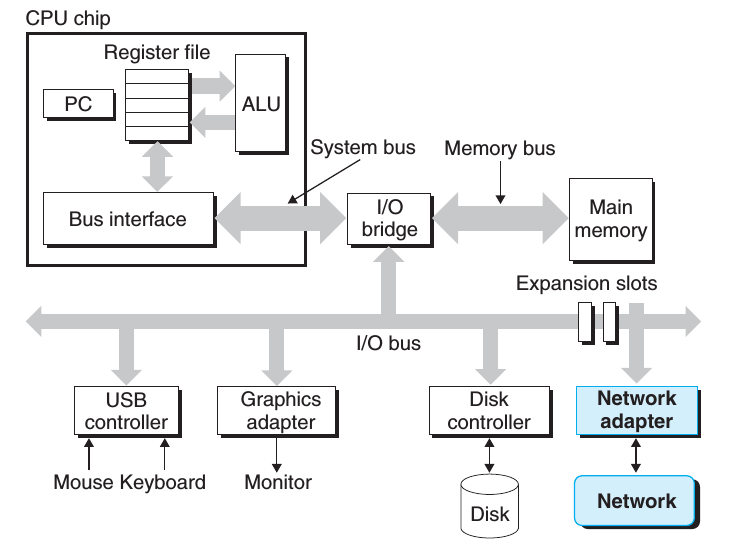

# 中央处理器（Central processing unit）

## 概念

CPU其实就是计算机内部的一个电子电路。根据一些具体的指令它可以执行基本的运算，逻辑，控制和IO操作等。CPU的主要组件包括：

 * 算术逻辑单元（ALU is short for ‘arithmetic logic unit’），它主要执行一些算术和逻辑操作
 * 处理器寄存器（processor registers），它主要的作用是给ALU提供操作数并存储ALU操作的结果
 * 控制器（control unit），通过协调ALU，寄存器和其它组件之间的操作，从主存中取得并执行相应的指令。

当今大多数地CPU都是微处理器，即它们被包含在单个集成电路芯片（integrated circuit chip）中。一个包含CPU的集成电路可能也包含内存，外围接口和其它的一些计算机组件。这样的集成设备叫做微控制器（microcontrollers）或者芯片上的系统（SoC）。一些计算机采用多核处理器，即单个芯片中包含2个或更多的CPU（也被叫做“cores”）; 在这种情况下，单个芯片有时也被称作”sockets”.

## 架构

目前市面上的CPU分类主要分有两大阵营，一个是intel、AMD为首的复杂指令集CPU，另一个是以IBM、ARM为首的精简指令集CPU。两个不同品牌的CPU，其产品的架构也不相同，例如，Intel、AMD的CPU是X86架构的，而IBM公司的CPU是PowerPC架构，ARM公司是ARM架构。

## CPU中的一些技术

### Hyper-Threading

Hyper-threading这个概念是Intel提出的，通常个人处理器仅有单个CPU核心，因此它一次只能做一件事情。但是Hyper-threading技术的出现弥补了这个不足。

Hyperthreading 有时叫做 simultaneous multi-threading，它可以使我们的单核CPU执行多个控制流程。这个技术会涉及到备份一些CPU硬件的一些信息，比如程序计数器和寄存器文件等，而对于比如执行浮点运算的单元它只有一个备份，可以被共享。一个传统的处理器在线程之间切换大约需要20000时钟周期，而一个具有Hyperthreading技术的处理器只需要1个时钟周期，因此这大大减小了线程之间切换的成本。hyperthreading技术的关键点就是：当我们在处理器中执行代码时，很多时候处理器并不会使用到全部的计算能力，部分计算能力会处于空闲状态，而hyperthreading技术会更大程度地“压榨”处理器。举个例子，如果一个线程必须要等到一些数据加载到缓存中以后才能继续执行，此时CPU可以切换到另一个线程去执行，而不用去处于空闲状态，等待当前线程的IO执行完毕。

Hyper-threading 使操作系统认为处理器的核心数是实际核心数的2倍，因此如果有4个核心的处理器，操作系统会认为处理器有8个核心。这项技术通常会对程序有一个性能的提升，通常提升的范围大约在15%-30%之间，对于一些程序来说它的性能甚至会小于20%, 其实性能是否提升这完全取决于具体的程序。比如，这2个逻辑核心都需要用到处理器的同一个组件，那么一个线程必须要等待。因此，Hyper-threading只是一种“欺骗”手段，对于一些程序来说，它可以更有效地利用CPU的计算能力，但是它的性能远没有真正有2个核心的处理器性能好，因此它不能替代真正有2个核心的处理器。但是同样都是2核的处理器，一个有hyper-threading技术而另一个没有，那么有这项技术的处理器在大部分情况下都要比没有的好。

### 多核

相比于多个处理器而言，多核处理器把多个CPU（核心）集成到单个集成电路芯片（integrated circuit chip）中，因此主板的单个socket也可以适应这样的CPU，不需要去更更改一些硬件结构。一个双核的CPU有2个中央处理单元，因此不像上面我介绍的hyper-threading技术那样，操作系统看到的只是一种假象，这回操作系统看到的是真正的2个核心，所以2个不同的进程可以分别在不同的核心中同时执行，这大大加快了系统的速度。由于2个核心都在一个芯片上，因此它们之间的通信也要更快，系统也会有更小地延迟。

下图展示了一个Intel Core i7处理器的一个组织结构，这个微处理器芯片中有4个CPU核，每个核中都有它自己的L1和L2缓存。

### 多处理器

我们一直以来的目标就是想要计算机可以做更多的事情，并且做的更快。因此人们想到通过增加CPU的数量来增加计算机的计算机能力和速度，但是这样的方法并没有在个人PC中得到普及，我们只会在一些超级计算机或者一些服务器上会看到这个多个CPU的计算机。因为多个CPU会需要主板有多个CPU socket - 多个CPU被插入到不同的socket中。同时主板也需要额外的硬件去连接这些CPU socket到RAM和一些其它的资源。如果CPU之间需要彼此通信，多个CPU的系统会有很大地开销。

SMP(Symmetric Multi-Processor)

所谓对称多处理器结构，是指服务器中多个CPU对称工作，无主次或从属关系。各CPU共享相同的物理内存，每个 CPU访问内存中的任何地址所需时间是相同的，因此SMP也被称为一致存储器访问结构(UMA：Uniform Memory Access)。对SMP服务器进行扩展的方式包括增加内存、使用更快的CPU、增加CPU、扩充I/O(槽口数与总线数)以及添加更多的外部设备(通常是磁盘存储)。

SMP服务器的主要特征是共享，系统中所有资源(CPU、内存、I/O等)都是共享的。也正是由于这种特征，导致了SMP服务器的主要问题，那就是它的扩展能力非常有限。对于SMP服务器而言，每一个共享的环节都可能造成SMP服务器扩展时的瓶颈，而最受限制的则是内存。由于每个CPU必须通过相同的内存总线访问相同的内存资源，因此随着CPU数量的增加，内存访问冲突将迅速增加，最终会造成CPU资源的浪费，使 CPU性能的有效性大大降低。实验证明，SMP服务器CPU利用率最好的情况是2至4个CPU。

NUMA(Non-Uniform Memory Access)

由于SMP在扩展能力上的限制，人们开始探究如何进行有效地扩展从而构建大型系统的技术，NUMA就是这种努力下的结果之一。利用NUMA技术，可以把几十个CPU(甚至上百个CPU)组合在一个服务器内。其CPU模块结构如图2所示： 

NUMA服务器的基本特征是具有多个CPU模块，每个CPU模块由多个CPU(如4个)组成，并且具有独立的本地内存、I/O槽口等。由于其节点之间可以通过互联模块(如称为Crossbar Switch)进行连接和信息交互，因此每个CPU可以访问整个系统的内存。显然，访问本地内存的速度将远远高于访问远地内存(系统内其它节点的内存)的速度，这也是非一致存储访问NUMA的由来。由于这个特点，为了更好地发挥系统性能，开发应用程序时需要尽量减少不同CPU模块之间的信息交互。利用NUMA技术，可以较好地解决原来SMP系统的扩展问题，

但NUMA技术同样有一定缺陷，由于访问远地内存的延时远远超过本地内存，因此当CPU数量增加时，系统性能无法线性增加。如HP公司发布Superdome服务器时，曾公布了它与HP其它UNIX服务器的相对性能值，结果发现，64路CPU的Superdome (NUMA结构)的相对性能值是20，而8路N4000(共享的SMP结构)的相对性能值是6.3。从这个结果可以看到，8倍数量的CPU换来的只是3倍性能的提升。
