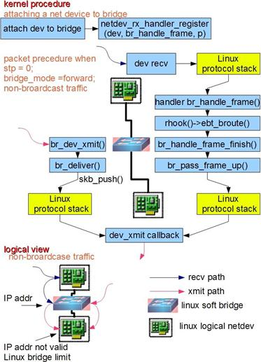

# Bridge

  Bridge（桥）是Linux上用来做TCP/IP二层协议交换的设备，与现实世界中的交换机功能相似。Bridge设备实例可以和Linux上其他网络设备实例连接，既attach一个从设备，类似于在现实世界中的交换机和一个用户终端之间连接一根网线。当有数据到达时，Bridge会根据报文中的MAC信息进行广播、转发、丢弃处理。

  
  
  Bridge的功能主要在内核里实现。当一个从设备被attach到Bridge上时，相当于现实世界里交换机的端口被插入了一根连有终端的网线。这时在内核程序里，netdev_rx_handler_register()被调用，一个用于接受数据的回调函数被注册。以后每当这个从设备收到数据时都会调用这个函数可以把数据转发到Bridge上。当Bridge接收到此数据时，br_handle_frame()被调用，进行一个和现实世界中的交换机类似的处理过程：判断包的类别（广播/单点），查找内部MAC端口映射表，定位目标端口号，将数据转发到目标端口或丢弃，自动更新内部MAC端口映射表以自我学习。

  Bridge和现实世界中的二层交换机有一个区别，图中左侧画出了这种情况：数据被直接发到Bridge上，而不是从一个端口接受。这种情况可以看做Bridge自己有一个MAC可以主动发送报文，或者说Bridge自带了一个隐藏端口和寄主Linux系统自动连接，Linux上的程序可以直接从这个端口向Bridge上的其他端口发数据。所以当一个Bridge拥有一个网络设备时，如bridge0加入了eth0时，实际上bridge0拥有两个有效MAC地址，一个是bridge0的，一个是eth0的，他们之间可以通讯。由此带来一个有意思的事情是，Bridge可以设置IP地址。通常来说IP地址是三层协议的内容，不应该出现在二层设备Bridge上。但是Linux里Bridge是通用网络设备抽象的一种，只要是网络设备就能够设定IP地址。当一个bridge0拥有IP后，Linux便可以通过路由表或者IP表规则在三层定位bridge0，此时相当于Linux拥有了另外一个隐藏的虚拟网卡和Bridge的隐藏端口相连，这个网卡就是名为bridge0的通用网络设备，IP可以看成是这个网卡的。当有符合此IP的数据到达bridge0时，内核协议栈认为收到了一包目标为本机的数据，此时应用程序可以通过Socket接收到它。一个更好的对比例子是现实世界中的带路由的交换机设备，它也拥有一个隐藏的MAC地址，供设备中的三层协议处理程序和管理程序使用。设备里的三层协议处理程序，对应名为bridge0的通用网络设备的三层协议处理程序，即寄主Linux系统内核协议栈程序。设备里的管理程序，对应bridge0寄主Linux系统里的应用程序。

  Bridge的实现当前有一个限制：当一个设备被attach到Bridge上时，那个设备的IP会变的无效，Linux不再使用那个IP在三层接受数据。举例如下：如果eth0本来的IP是192.168.1.2，此时如果收到一个目标地址是192.168.1.2的数据，Linux的应用程序能通过Socket操作接受到它。而当eth0被attach到一个bridge0时，尽管eth0的IP还在，但应用程序是无法接受到上述数据的。此时应该把IP192.168.1.2赋予bridge0。

  另外需要注意的是数据流的方向。对于一个被attach到Bridge上的设备来说，只有它收到数据时，此包数据才会被转发到Bridge上，进而完成查表广播等后续操作。当请求是发送类型时，数据是不会被转发到Bridge上的，它会寻找下一个发送出口。用户在配置网络时经常忽略这一点从而造成网络故障。
